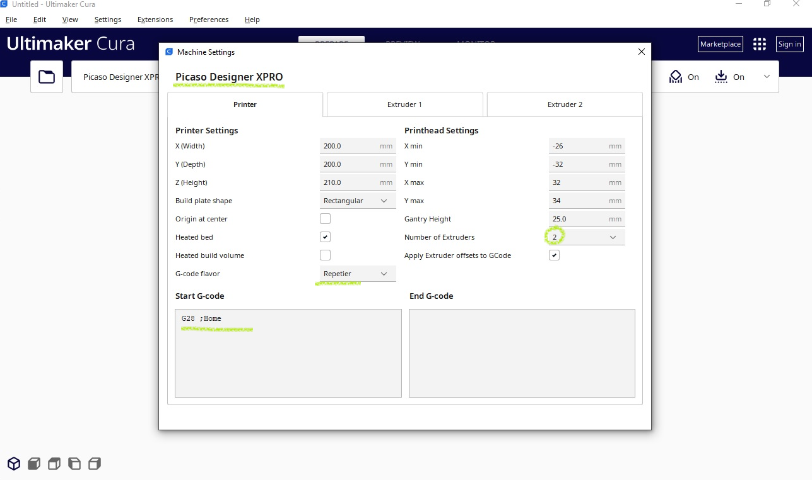

# Добавление принтера Picaso X/X Pro в Cura

В зависимости от версии Cura, содержимое папки resources из архива Ultimaker **Cura_PicasoX.zip** распаковать в соотвествующую папку (указаны пути установки Cura по-умолчанию):

**Cura 5.x:**
C:\Program Files\Ultimaker Cura 5.x\share\cura\resources\

**Cura 4.x:**
C:\Program Files\Ultimaker Cura 4.10\resources\

Запустить Cura и в списке доступных принтеров появится Picaso/Designer XPro.

*Для X Pro:*

В поле "Начальный G-код для экструдера", чтобы после переключения сопел активное сопло прочищалось в специальном очистителе, необходимо прописать:

*Extruder 1 Start G-code (для первого или единственного экструдера):
T10 I5 S1 R1 P1

Extruder 2 Start G-code (для второго экструдера):
T11 I5 S1 R1 P1*

Для очистки сопел возможно использовать черновую башню, а не сопливчики: для этого в настройках принтера включить "быстрое переключение сопел".

*Для X* 
Указать количество экструдеров (extruder count) = 1

Икс-серия сама всё умеет делать и при печати G-кода принтер выполняет зашитый в прошивку обязательный код перед печатью и после печати.

Инструкция по использованию сторонних слайсеров (Cura, PrusaSlicer) для принтеров Designer Classic, X, XPro, XL, XLPro в Центре поддержки: http://helpcenter.picaso-3d.ru/we-answer
