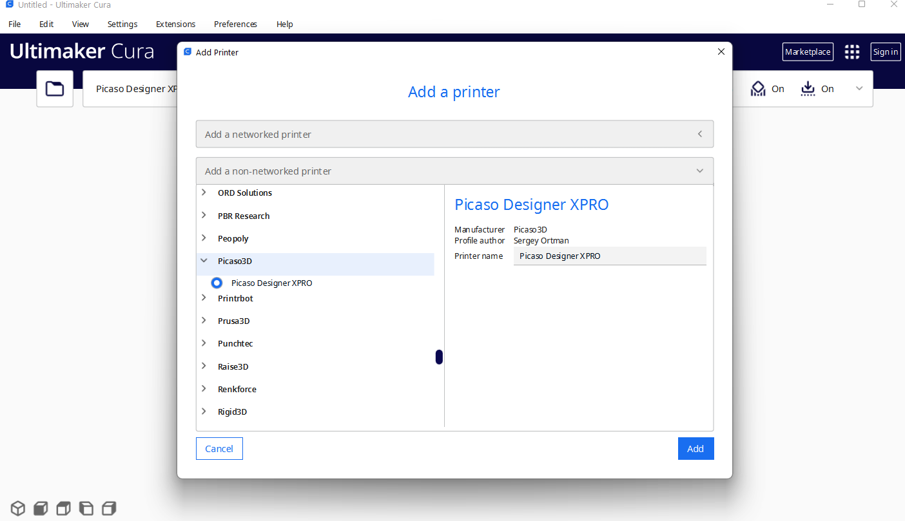

# Добавление принтера Picaso X/X Pro в Cura

В зависимости от версии Cura, содержимое папки resources из архива Ultimaker **Cura_PicasoX.zip** распаковать в соотвествующую папку (указаны пути установки Cura по-умолчанию):

**Cura 5.x:**
C:\Program Files\Ultimaker Cura 5.x\share\cura\resources\

**Cura 4.x:**
C:\Program Files\Ultimaker Cura 4.10\resources\

Запустить Cura и в списке доступных принтеров появится Picaso/Designer XPro.

*Для X Pro:*
Для очистки сопел используется черновая башня, а не сопливчики, для этого в настройках принтера включить "быстрое переключение сопел".

*Для X* 
Указать количество экструдеров (extruder count) = 1

Инструкция по использованию сторонних слайсеров (в том числе Cura) в Центре поддержки: http://helpcenter.picaso-3d.ru/we-answer
