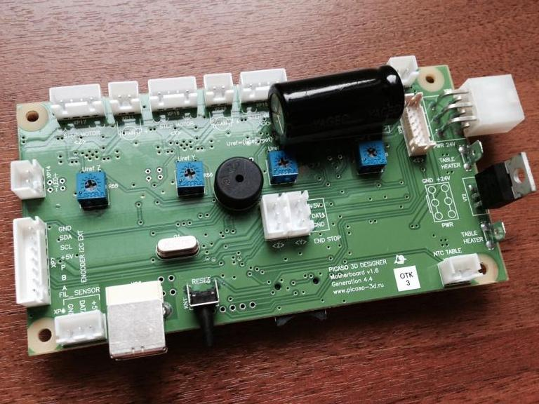

# Фотографии плат принтера Picaso Designer

Транзистор управления вентилятором на радиаторе:

  
  

Плата управления:

  
  

  
  

  
  

  
  
    

Разное:

  
  
  

  
  
  

  
  

Посадочное место vT2А под транзистор (корпус D2PAK) для стола на многих версиях плат для Designer  пустое, так как транзистор (корпус ТО-220) установлен с другой стороны платы на месте с маркировкой vT2.
