# Designer XPRO

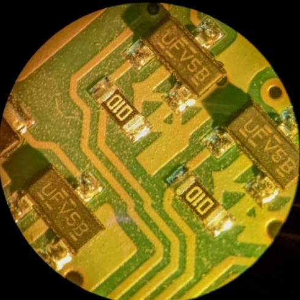
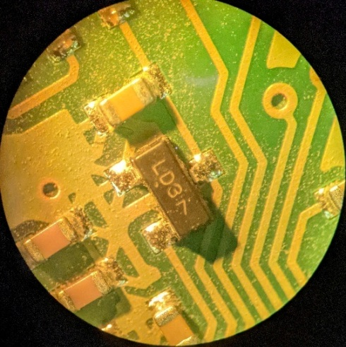
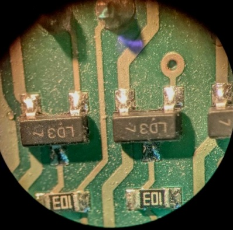

LD3 диод шоттки BAT54S (здесь производитель Secos, но можно другого производителя, например Taitron, Vishay, WTE, etc.).
UFV5B транзистор IRLML6344 (здесь U - IRLML6344, F - 2016 год изготовления, V - неделя изготовления, 5B - номер партии).

FT232RL (Future Technology Devices) преобразователь USB-UART

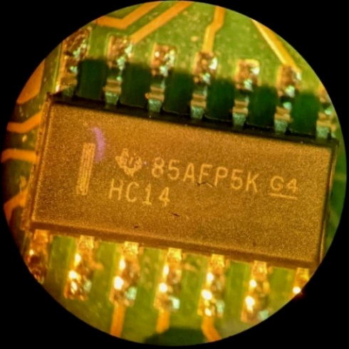

SN74HC14D HC14 инвертирующий триггер Шмитта SOIC-14 Texas Instruments

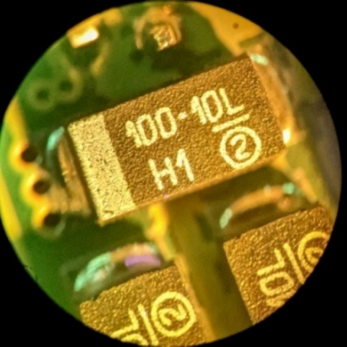

100-10L SMD танталовый конденсатор 100 мкФ 10 В Vishay серии 593В (H1 - дата производства). Корпус C (6х3,2 мм) или D (7,3х4,3 мм) согласно даташиту.

W1 диод 1N4148 SOD-123 75V

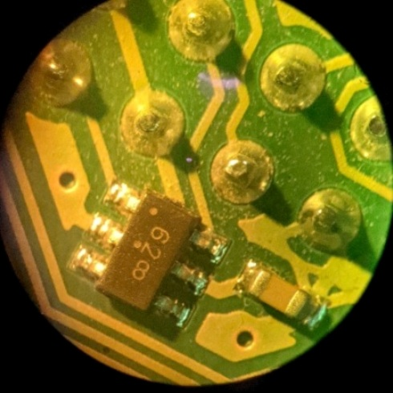

62 NUP2202W1 ESD Protection Diode 

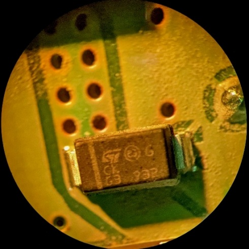

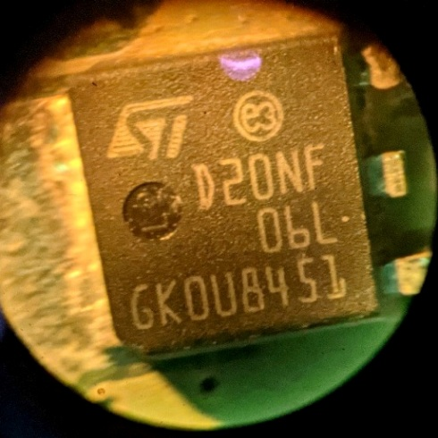

STD20NF06L N-channel 60 V, 32 mΩ typ., 24 A, Power MOSFET in DPAK package

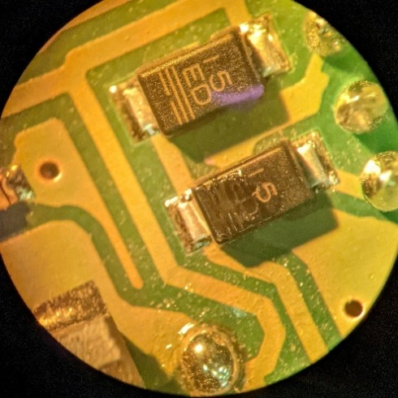

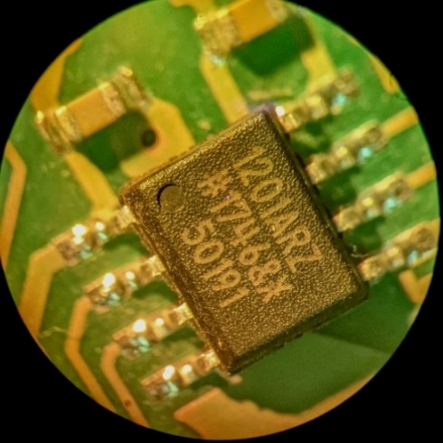

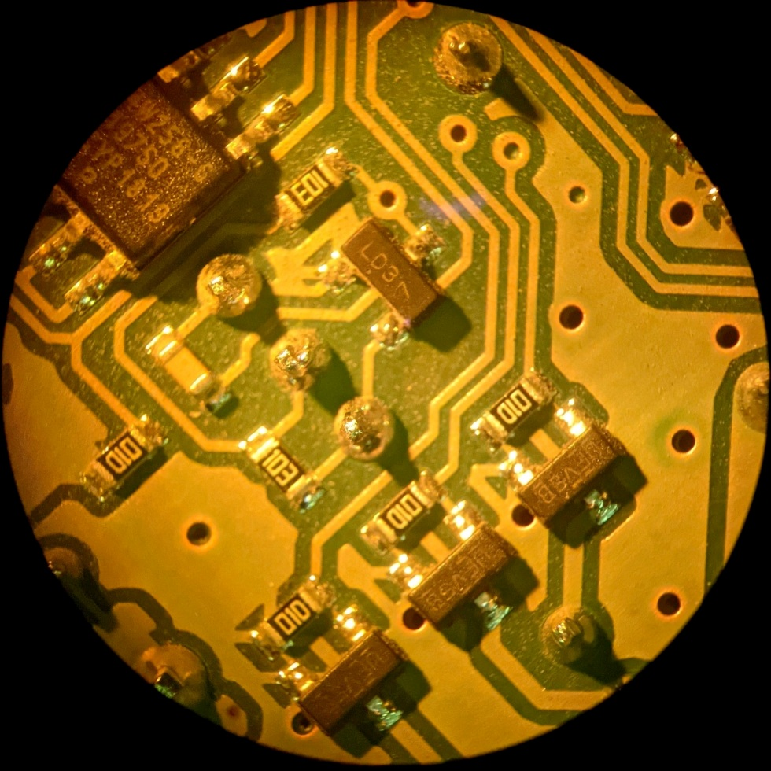

