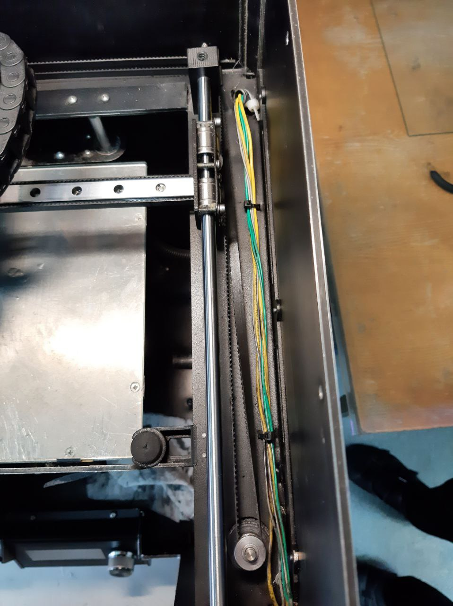

#Ремни PRO250

Cхема натяжки ремней Picaso designer PRO250:

  
  

  

<picture><source media="(prefers-color-scheme: dark)" srcset="https://cdn.simpleicons.org/telegram/white"> <source media="(prefers-color-scheme: light)" srcset="https://cdn.simpleicons.org/telegram/black"> </picture> [Источник](https://t.me/Picaso3dUnofficial/231107)
