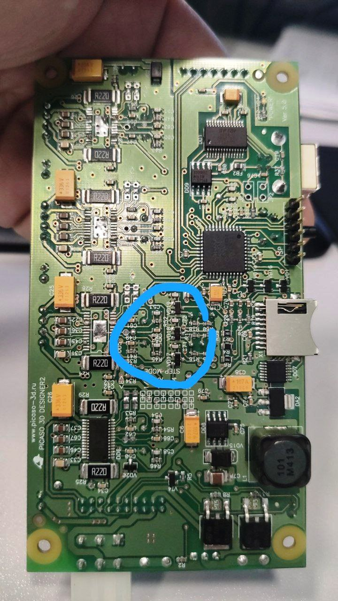
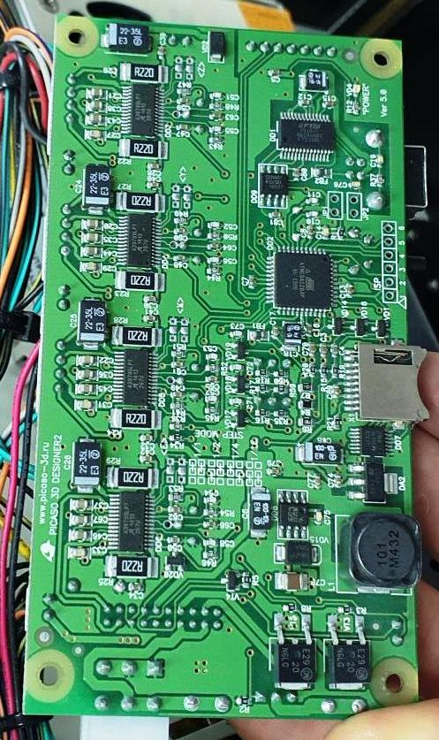

Фотографии плат принтера Picaso PRO250

  
   
  

  
   

Распиновка старой версии головы PRO250

VD17, VD18, VD190 (smd code A7 или V99G) Cборка высокоскоростная из 2 диодов BAV99 в корпусе sot-23
https://www.chipdip.ru/product/bav99-nxp

vT4 (smd code B6NU7) это IRLML2803, NPN

1002 - резистор 10 кОм

PRO250_Драйвер_IXDN604SIA
