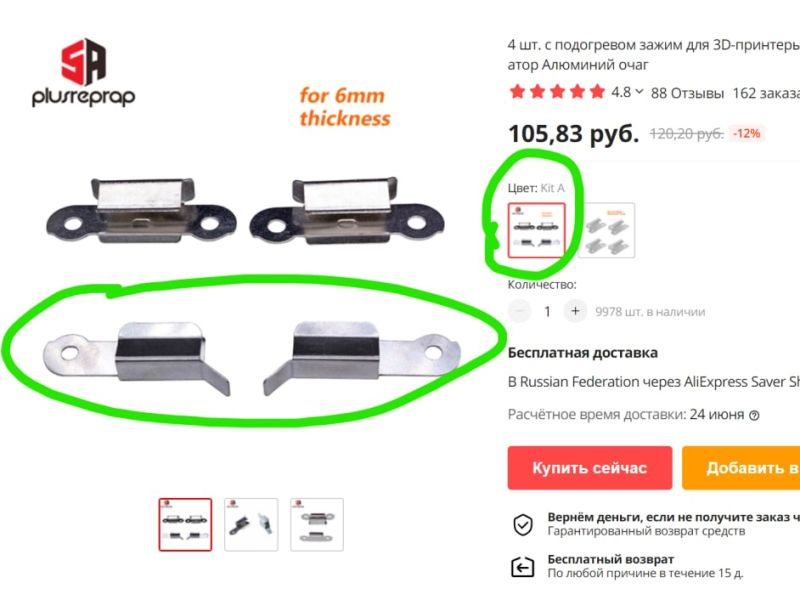

# Покупные радиоэлементы для ремонта принтеров Picaso

1. Клещи для обжима контактов: https://sl.aliexpress.ru/p?key=gGwexSX

1. Разъём PHD2.0: https://sl.aliexpress.ru/p?key=Jjtexmu

1. Зажим KINGROON для 3D-принтера: https://sl.aliexpress.ru/p?key=3zthxQy

1. Зажим для стёкол (подойдут для Х, XPRO, Classic): 	https://aliexpress.ru/item/4000275674667.html 

 	 
  	
	

1. Драйвер IXDN604SI: https://aliexpress.ru/item/1005002628524804.html

1. Вал-втулочный фиксатор Loctite 601/620/648/680 https://sl.aliexpress.ru/p?key=s5b0Zo

1. Тефлоновая трубка 1 метр:

    + https://a.aliexpress.com/_A3iYtX
    + https://aliexpress.ru/item/1005001661430005.html

1. Тефлоновая трубка в блок 250 (2IN/3OD, 2мм внутренний, 3мм наружный диаметры. При заказе с Али есть вероятность, что приедут трубки с внешним диаметром от 2.8 до 3.3мм):
https://aliexpress.ru/item/32730855848.html

1. Термосопротивление/термистор PT1000: https://aliexpress.ru/item/4000717733995.html

1. Кнопка вкл./выкл. (например, клавишный переключатель KCD1-201-4-C3 B/4P, можно с подсветкой, можно без): https://www.chipdip.ru/product0/8006791950

1. Оптопара (датчик положения в голове) в 250PRO: Panasonic CNA1312K0TLC (возможная замена: Omron EE-SX1105 DIP-4 2мм https://aliexpress.ru/item/1005003821997220.html)
