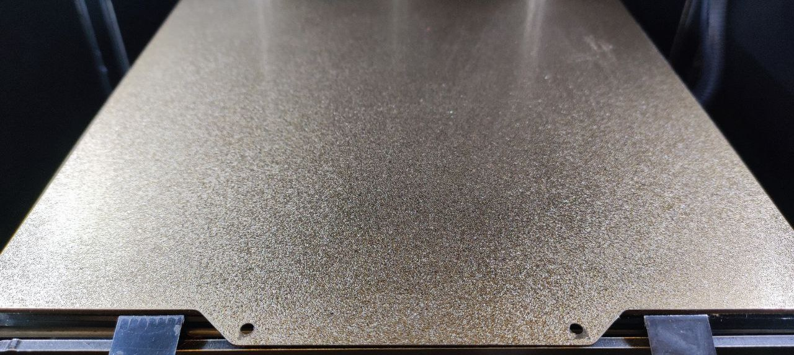
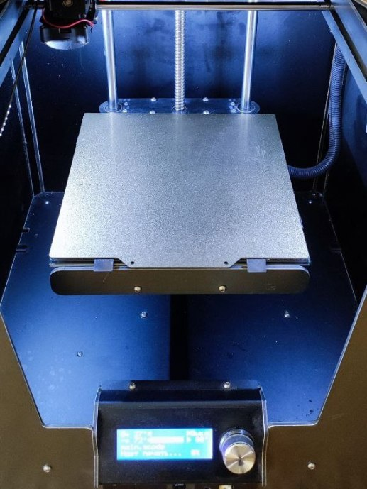
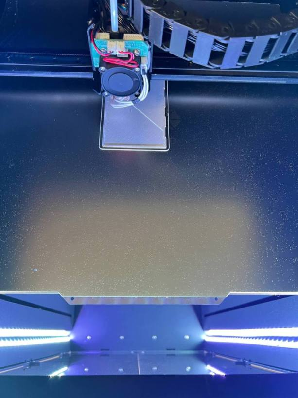

# Листы PEI для принтеров Picaso

Магнитная подложка для листа PEI клеится на стекло.

Лист PEI можно отпилить болгаркой, если не получится заказать нужный размер. Также можно спросить у продавца с Aliexpress - возможно, по заказу получится изготовить требуемый размер.

Ссылки для покупки:

1. https://sl.aliexpress.ru/p?key=HfHnxVD

2. https://a.aliexpress.com/_99EtPr

