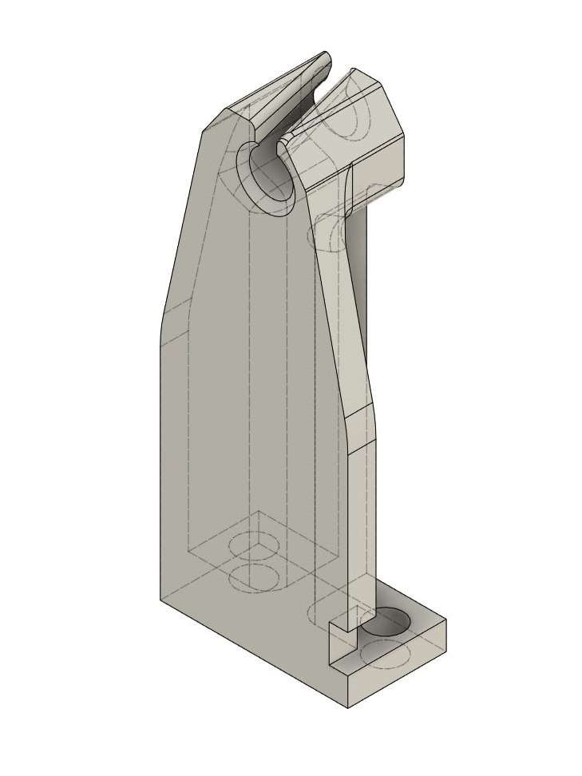

# Фиксатор трубок подачи Designer X для удобства печати Formax
---

Модифицированный держатель трубки подачи для Designer X для решения проблемы с обломом филамента Formax у основания печатной головы.

Отличия от дефолтного: на 1мм выше, чуть более прямой угол ушка.

<picture><source media="(prefers-color-scheme: dark)" srcset="https://cdn.simpleicons.org/telegram/white"> <source media="(prefers-color-scheme: light)" srcset="https://cdn.simpleicons.org/telegram/black"> </picture> [Источник](https://t.me/Picaso3dUnofficial/162624)
