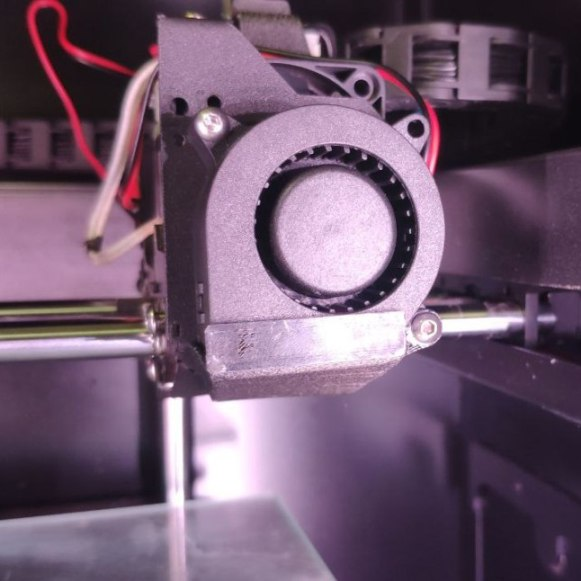

# Замена вентиляторов обдува детали для принтера Designer X

Вам потребуется:

+ Два вентилятора 4020 5 В (например: https://aliexpress.ru/item/4001073835616.html);
+ Два винта М3х14;
+ Два винта М3х18;
+ Две гайки М3;
+ Оригинальные металлические основания вентиляторов;
+ Распечатанные детали *4020_front_fan_DX_mod.STL*, *4020_rear_fan_DX_mod.STL* (толщина стенок моделей: 0,82 мм).

Алгоритм замены:

1. Снимите оригинальные вентиляторы обдува детали, ослабив по три винта на каждом.

1. Отогните и разберите направляющие потока воздуха.

1. Винтом М3х18 и гайкой прикрепите распечатанную деталь и вентилятор к металлическому основанию через нижнее отверстие вентилятора.

1. По отверстию, расположенному по диагонали от нижнего, наметьте ответное, просверлите отверстие 2,4 (2,5 мм), нарежьте резьбу М3, зафиксируйте вентилятор винтом М3х14.

1. Повторите п.1-4 со вторым вентилятором.

1. Установите новые вентиляторы обдува на место.

  
  

  
  

<picture><source media="(prefers-color-scheme: dark)" srcset="https://cdn.simpleicons.org/telegram/white"> <source media="(prefers-color-scheme: light)" srcset="https://cdn.simpleicons.org/telegram/black"> </picture> [Источник](https://t.me/Picaso3dUnofficial/259765)
