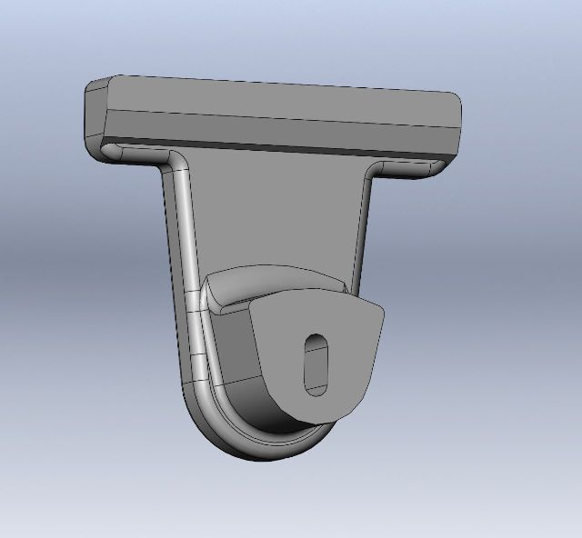
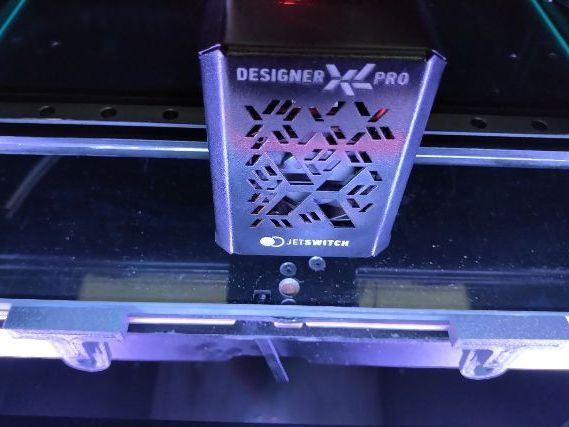
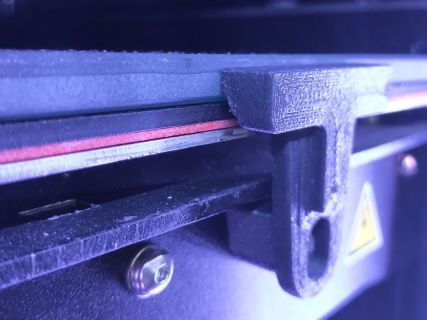
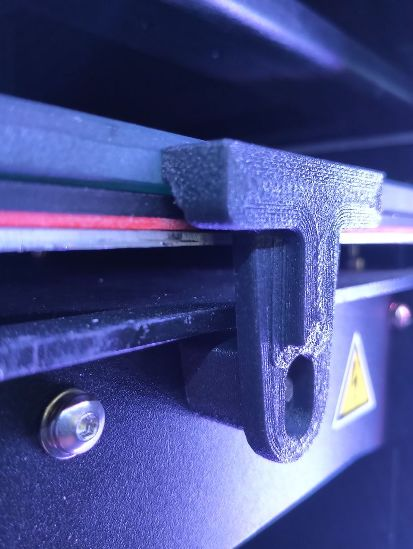

# Крепление стекла для Picaso XL
---

Рекомендуемый материал печати: Carbex CF (угленаполненный АБС от Cyberfiber) или что-то аналогичное, чтобы крепление держало температуру стола и не гнулось.

Модель сделана под винты, которые держали декоративную панель перед столом. 

Пластик креплений может стираться со временем.

