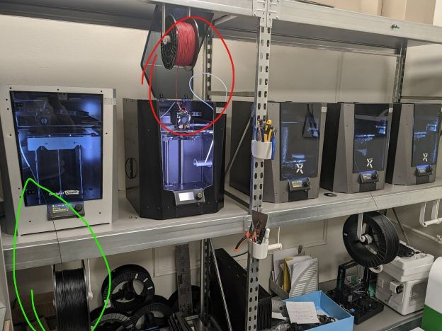

# Кронштейн для катушек.

Красным обведён пример использования с гибким пластиком для подачи сверху без трубки.
Зелёным обведён пример использования со всеми остальными пластиками, которые не требуют подачи сверху.
Кронштейны ездят по стеллажу влево-вправо.

