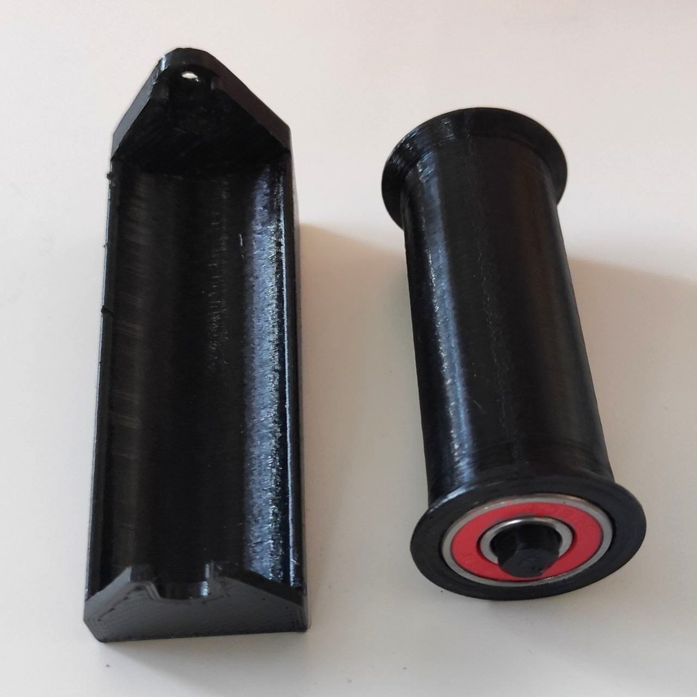
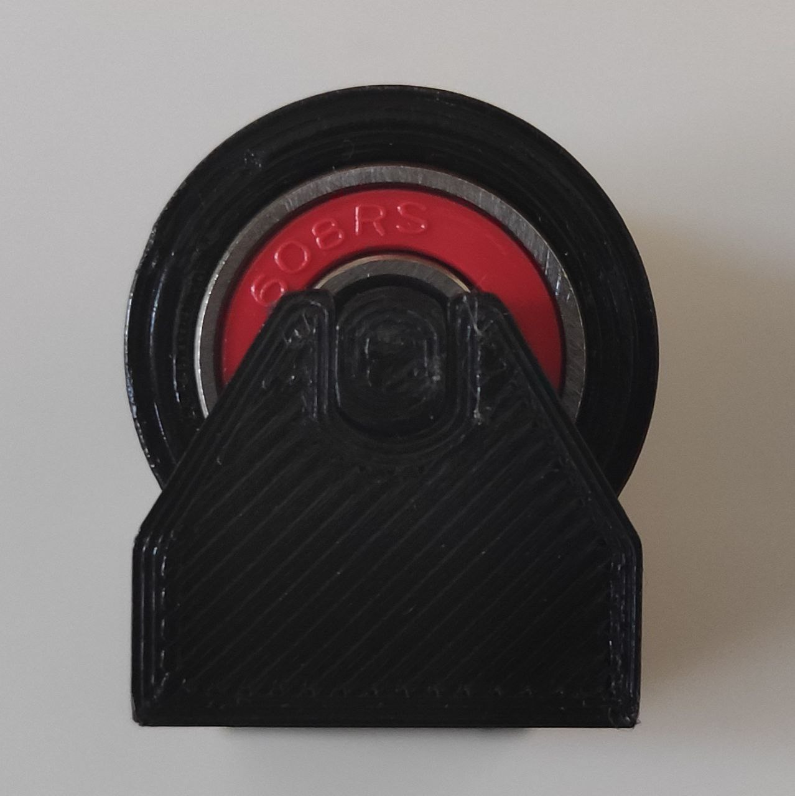
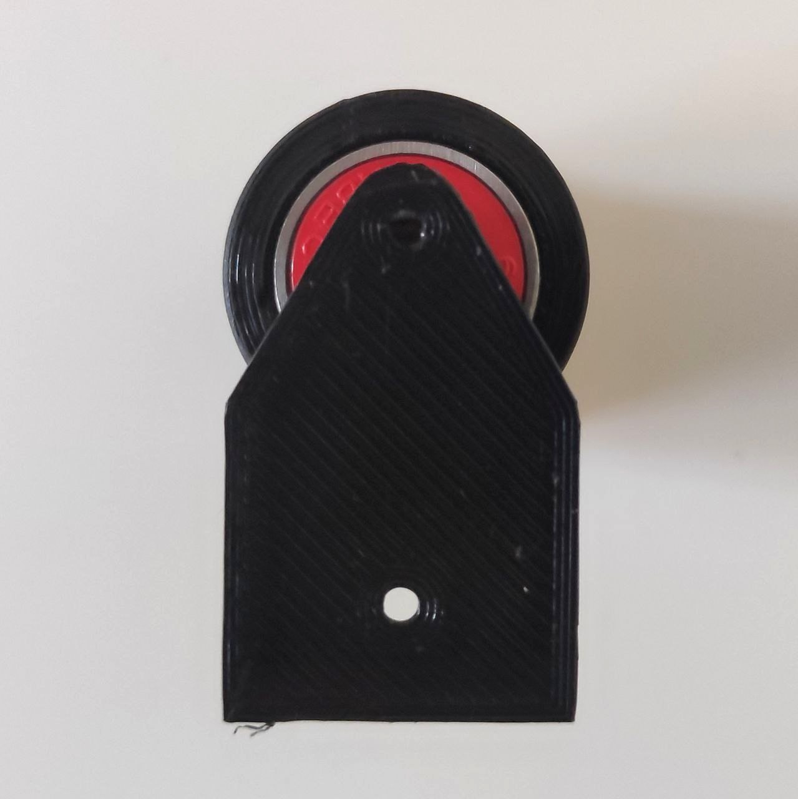
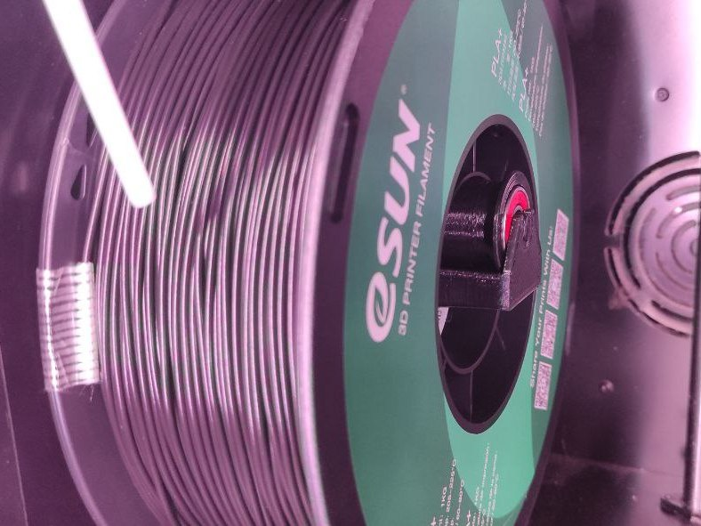
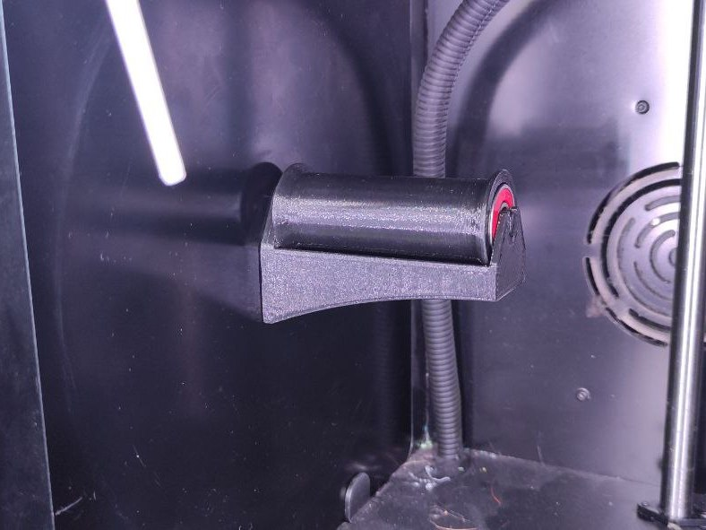

# Кронштейн для катушек с подшипниками

Подшипники ABEK 9 608ZZ 22х8х7 от скейтборда. Достаточно тугие. Если нужно потуже, открываем, смазываем по другому. Можно вообще не мазать.
И ещё: подача теперь без рывков. Пластик равномерно крутится на бобине.

Подшипники: https://aliexpress.ru/item/1005003067718206.html?spm=a2g0o.search.0.1.71ff33acQTtboB&_ga=2.105629507.1909495318.1648124397-948006961.1627798792&sku_id=12000023778028002

  
  
  

  
  

<picture><source media="(prefers-color-scheme: dark)" srcset="https://cdn.simpleicons.org/telegram/white"> <source media="(prefers-color-scheme: light)" srcset="https://cdn.simpleicons.org/telegram/black"> </picture> [Источник](https://t.me/Picaso3dUnofficial/210570)
