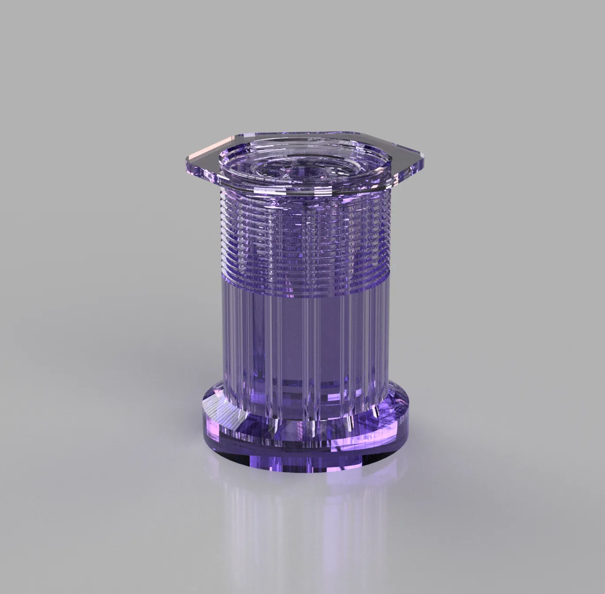
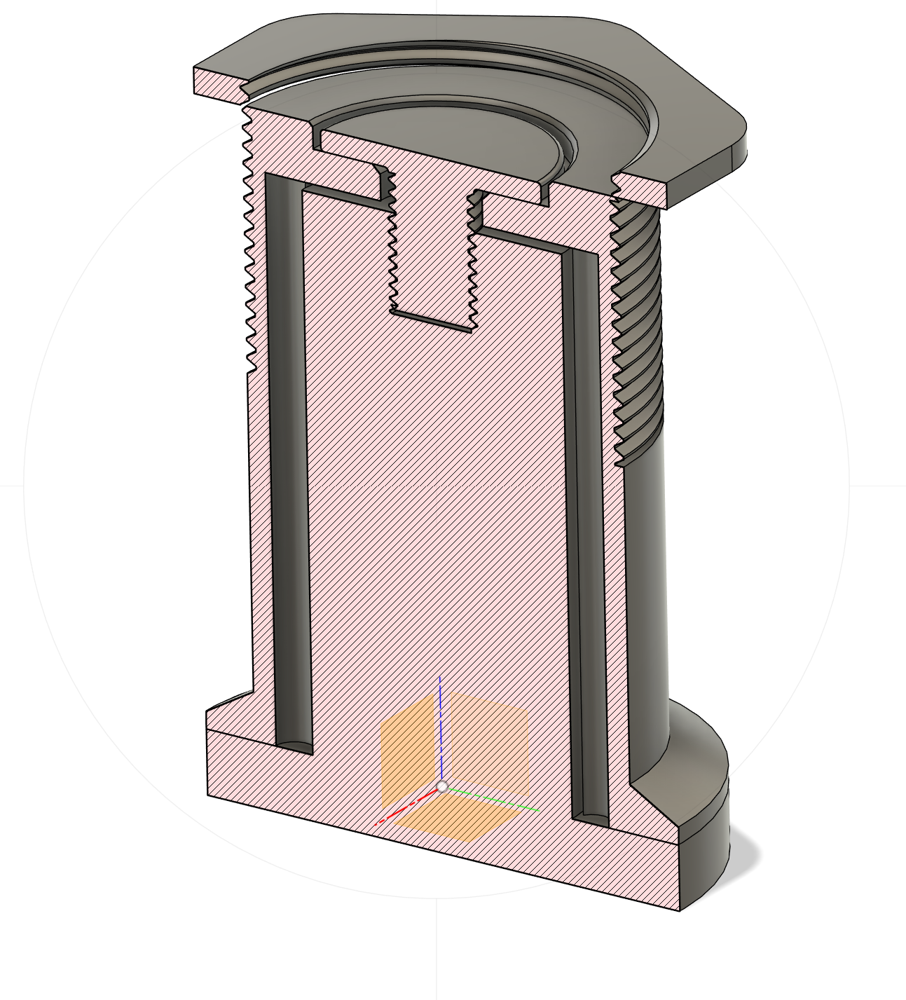
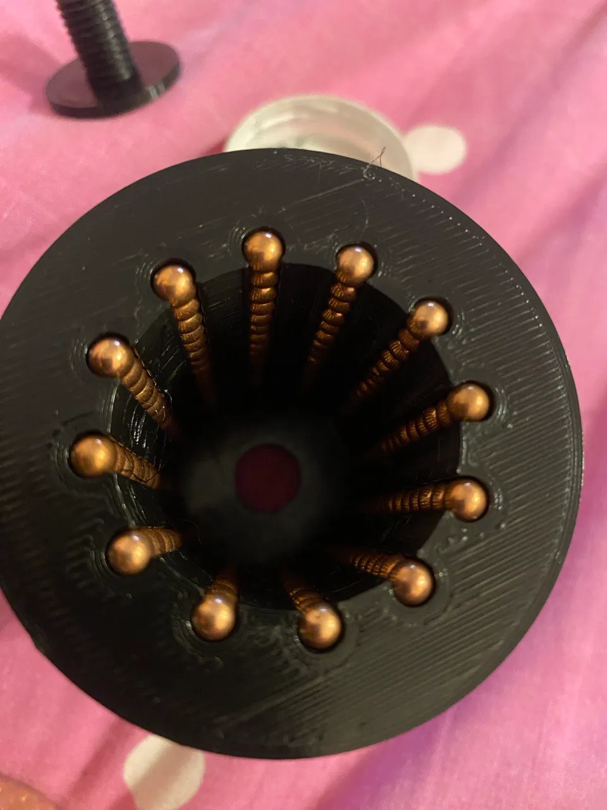
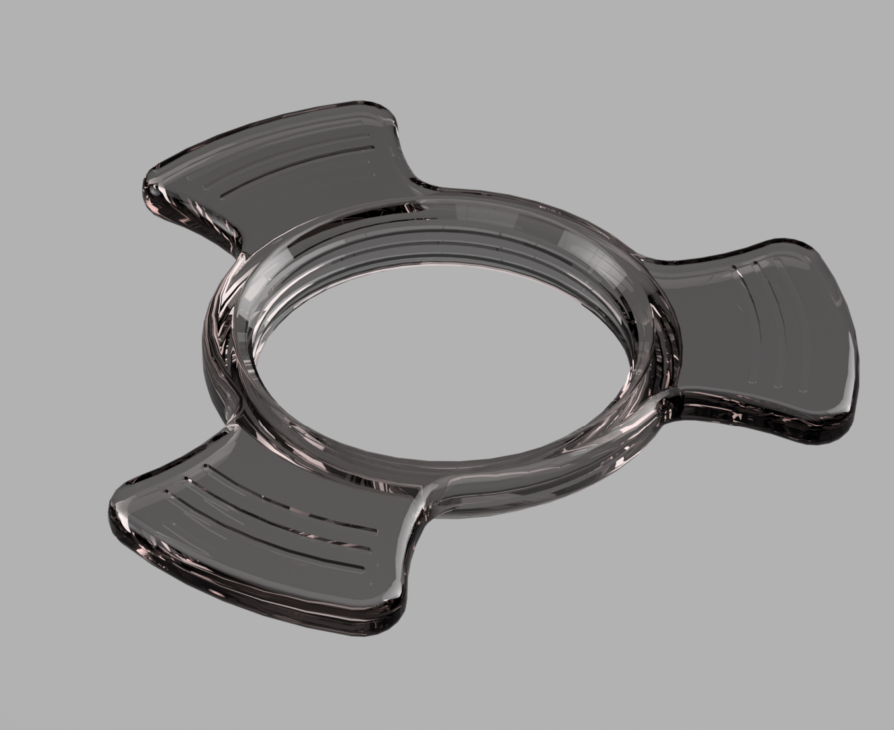

# Кронштейн для узких катушек

  

  

    Комопнент подшипника собирается с помощью шариков 4,5мм металлических. Для сборки использовать магнит для удобства, чтобы шарики не рассыпались.  

  

Дополнительная гайка

  

