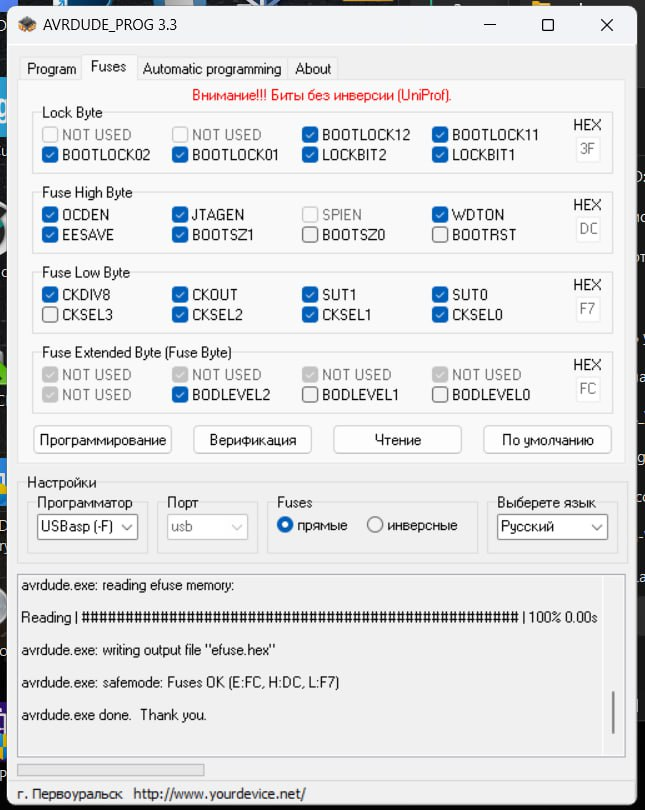

# Picaso Designer

Если сгорел микроконтроллер 1284p на Picaso Designer (Первом Дизайнере), то можно купить новый микроконтроллер и залить в него эту прошивку (Designer.HEX). 

Данная прошивка считана с рабочего принтера.

Фьюзы (Fuses):

  

<picture><source media="(prefers-color-scheme: dark)" srcset="https://cdn.simpleicons.org/telegram/white"> <source media="(prefers-color-scheme: light)" srcset="https://cdn.simpleicons.org/telegram/black"> </picture> [Источник](https://t.me/Picaso3dUnofficial/324008)
