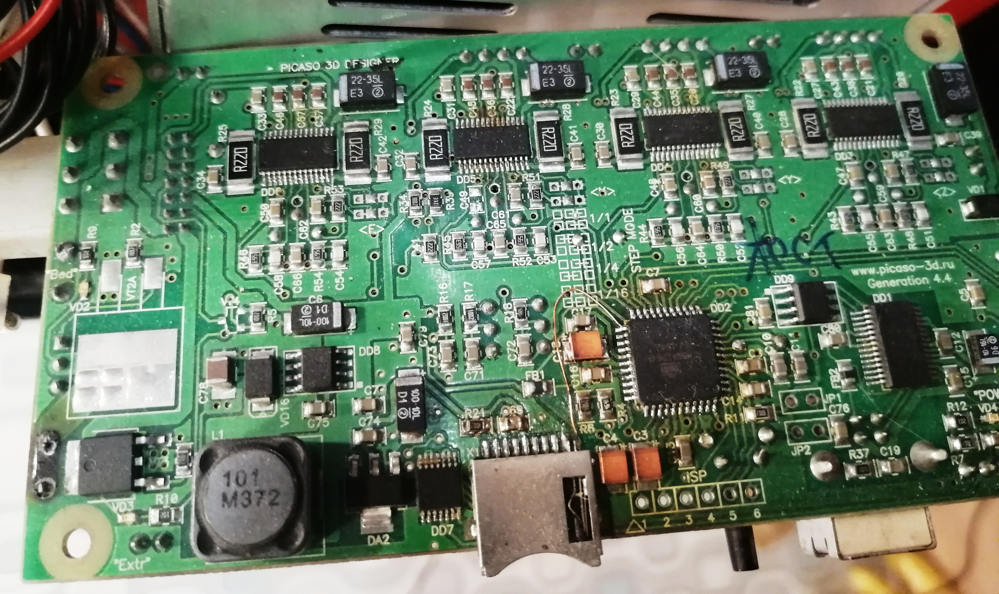
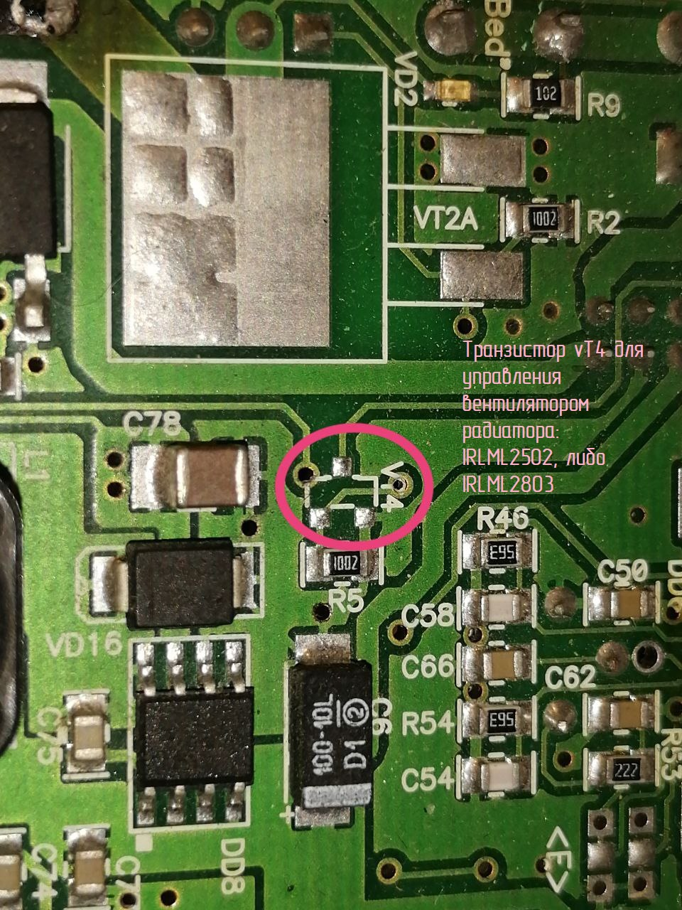
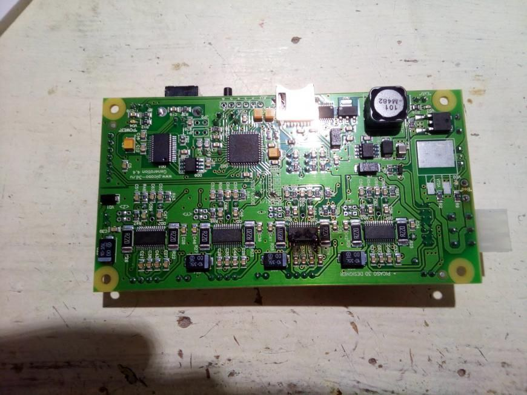
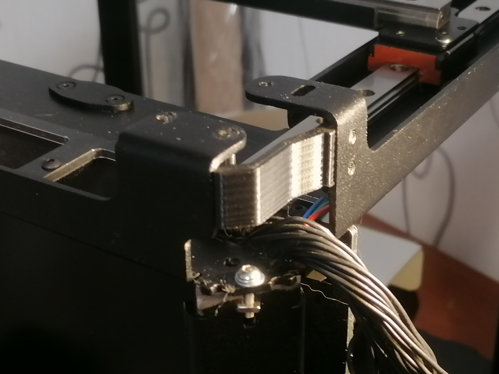
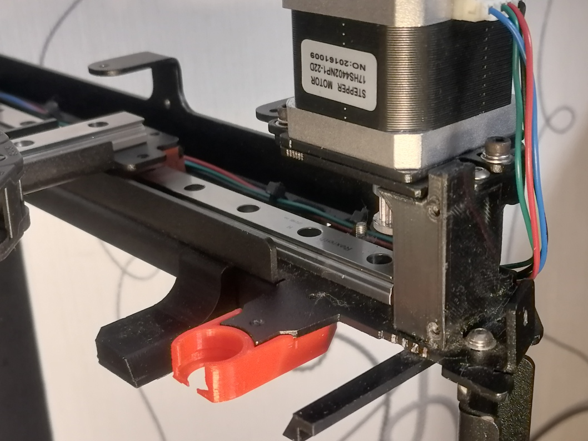
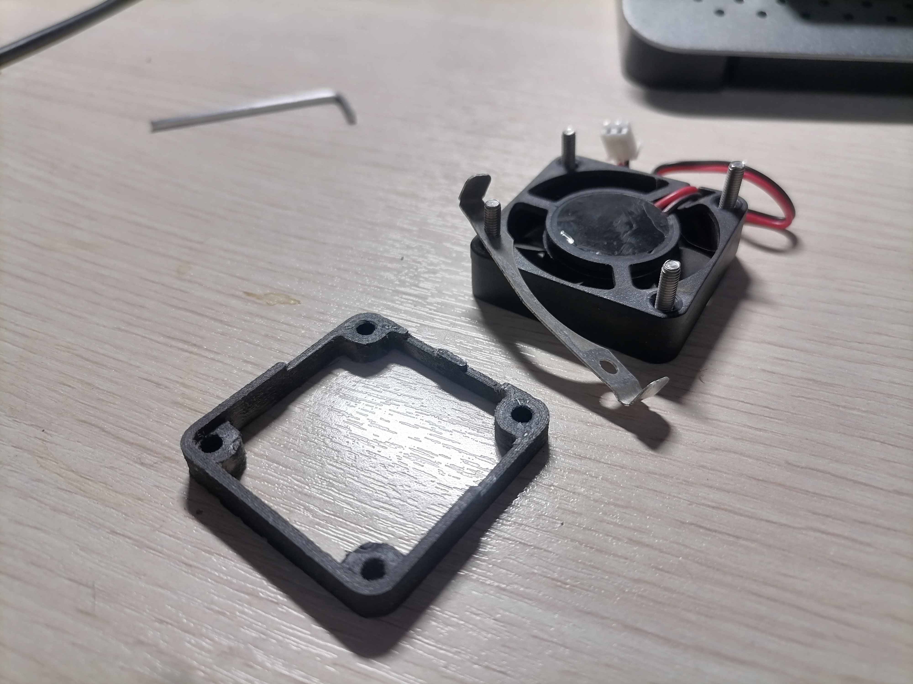
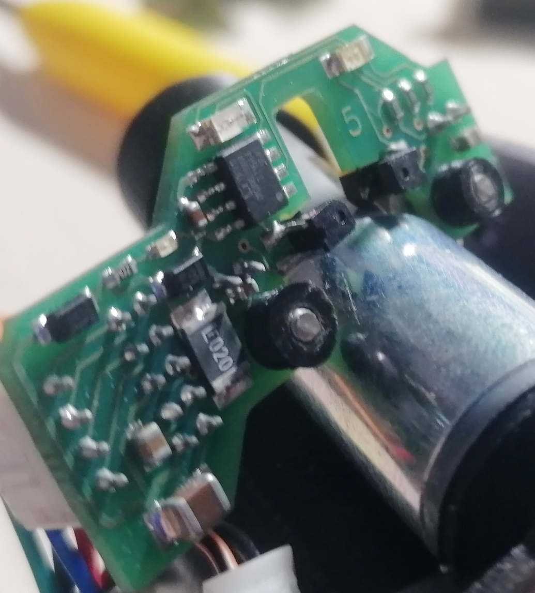
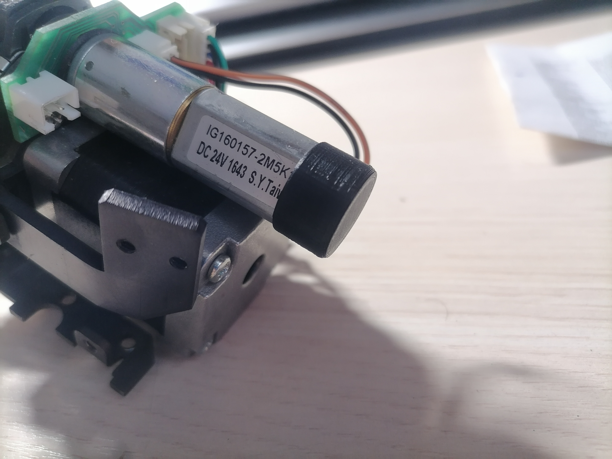
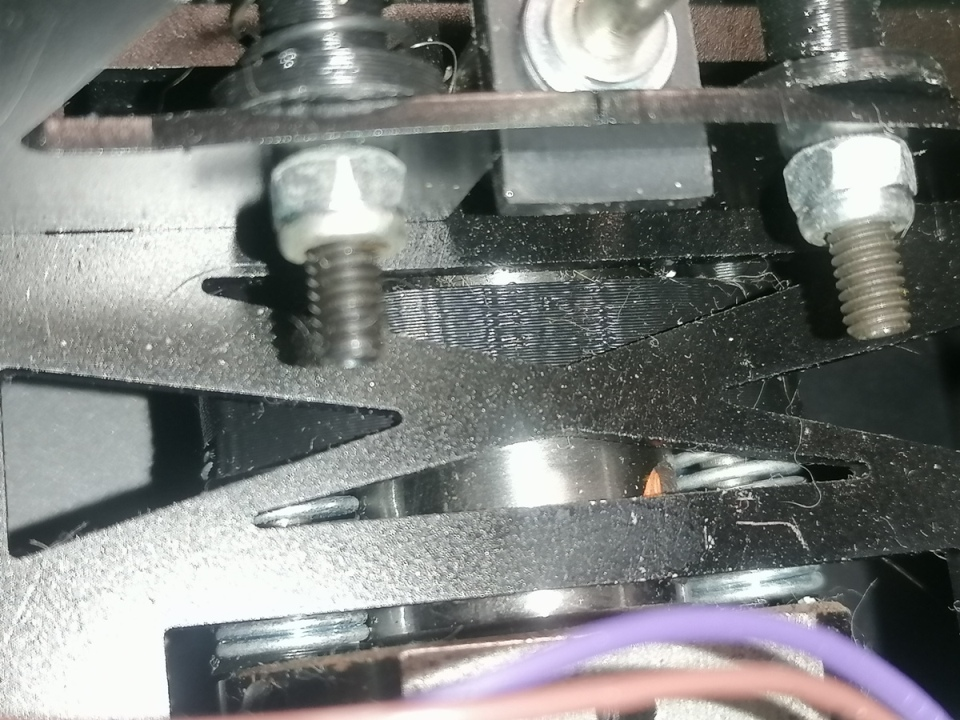

Фотографии плат принтера Picaso Designer
---

Посадочное место vT2А под транзистор (корпус D2PAK) для стола на многих версиях плат для Designer  пустое, так как транзистор (корпус ТО-220) установлен с другой стороны платы на месте с маркировкой vT2.