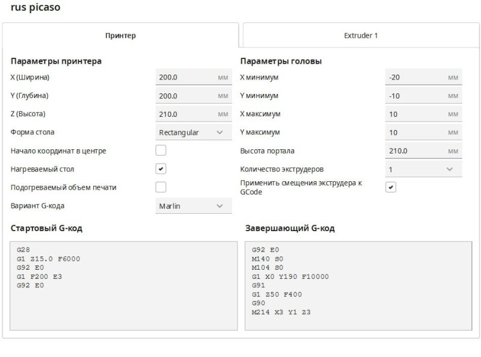

# Добавление принтера Picaso Designer X, Designer X PRO в Cura

В зависимости от версии Cura, содержимое папки resources из архива Ultimaker **Cura_PicasoX.zip** распаковать в соотвествующую папку (указаны пути установки Cura по-умолчанию):

**Cura 5.x:**
C:\Program Files\Ultimaker Cura 5.x\share\cura\resources\

**Cura 4.x:**
C:\Program Files\Ultimaker Cura 4.10\resources\

1. Запустить Cura. В списке доступных принтеров появится Picaso/Designer XPro.


2. В поле «Начальный G-код для экструдера», чтобы после переключения сопел активное сопло прочищалось в специальном очистителе, необходимо прописать:

*Extruder 1 Start G-code (для первого или единственного экструдера):*

```
T10 I5 S1 R1 P1
```

*Extruder 2 Start G-code (для второго экструдера):*

```
T11 I5 S1 R1 P1
```


>Для очистки сопел возможно использовать черновую башню, а не сопливчики: для этого в настройках принтера включить "быстрое переключение сопел".

Для Designer X необходимо изменить количество экструдеров (extruder count) = 1.


>X-серия сама всё умеет делать и при печати G-кода принтер выполняет зашитый в прошивку обязательный код перед печатью и после печати.

3. Для корректной работы системы контроля подачи пластика добавьте специальный скрипт. Для этого в меню *Extensions > Post processing > Modify G-code* нажмите *«Add a script»* и выберите *Search and Replace*. Впишите следующие скрипты:

*Search:*

```
;LAYER:
```

*Replace:*

```
M532 X0 L
```


>Дополнительная информация и инструкция по использованию сторонних слайсеров (Cura, PrusaSlicer) для принтеров Designer Classic, X, XPro, XL, XLPro в [Центре поддержки](http://helpcenter.picaso-3d.ru/we-answer).

---
# Picaso Designer

Пример стартового и завершающего G-кода для Picaso Designer.



Также примеры стартового кода для Picaso Designer и PRO250 есть [в статье про Simplify3D](https://github.com/Octopusmode/Picaso3D/tree/master/_S3D_%D0%B4%D0%BB%D1%8F_Picaso_%D0%A1%D1%82%D0%B0%D1%82%D1%8C%D1%8F_%D0%BE_%D0%BD%D0%B0%D1%81%D1%82%D1%80%D0%BE%D0%B9%D0%BA%D0%B5#81-designer-pro250).

<picture><source media="(prefers-color-scheme: dark)" srcset="https://cdn.simpleicons.org/telegram/white"> <source media="(prefers-color-scheme: light)" srcset="https://cdn.simpleicons.org/telegram/black"> </picture> [Источник](https://t.me/Picaso3dUnofficial/275116)
