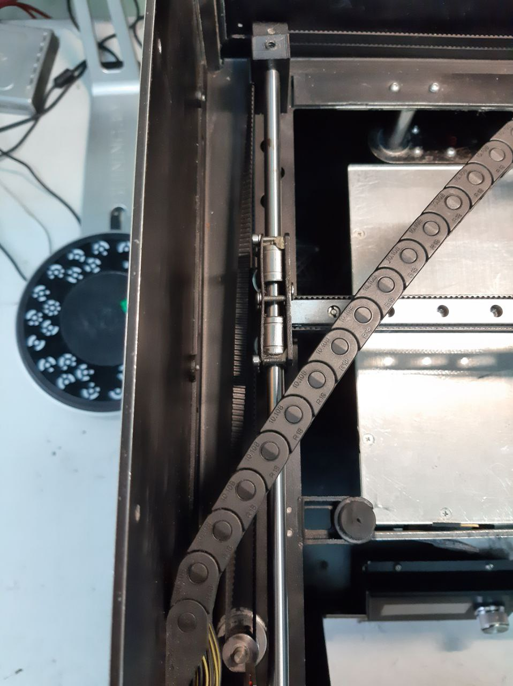
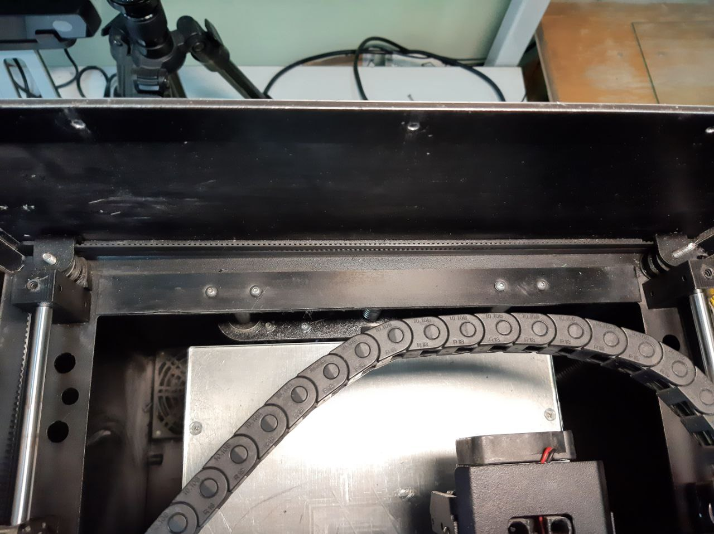

# Замена ремней Designer, PRO250

По ссылке ниже инструкция из двух частей по замене ремней (используется два ремня) на Designer.

Длина ремней: по 118см. Ремень T2.5, 6мм.

https://www.youtube.com/channel/UCA1QKyfp9iYxaACnGU5Resg

На PRO250 принцип аналогичный. Длина ремней: по 118см. Ремень T2.5, 6мм.

Разница в том, что на PRO250 каждый конец ремня фиксируется металлическим зажимом ровно на 4 зубца, вместо 3-х на Designer.

---
Cхема натяжки ремней Picaso PRO250:

  
  

  

<picture><source media="(prefers-color-scheme: dark)" srcset="https://cdn.simpleicons.org/telegram/white"> <source media="(prefers-color-scheme: light)" srcset="https://cdn.simpleicons.org/telegram/black"> </picture> [Источник](https://t.me/Picaso3dUnofficial/231107)

---

Возможно будет полезнен опыт замены ремней на Designer: 

Ремни на Picaso Designer 1 gen (первое поколение):
+ Количество ремней: 2
+ Шаг: 2.5мм
+ Форма зубца: трапецевидная (T2.5)
+ Ширина: 6мм 
+ Длина одного ремня: 1192.5 мм (из саппорта https://picaso3d-club.ru/forum/forum37/158-zamena-remney-ekstrudera-na-picaso-3d-designer)
+ Реальная длина: 1192,5 мм (477 зубцов)

Когда ставил, оказалось, что даже по ссылке у пикасы написано не корректно!
Реальная длина, когда нормально ремень натянут, на зуб короче, т.е. 1190 мм. Но мой совет, сперва поставить 477 зубцов и 1192.5 мм, и если будет как сопля натянут, то на зуб укоротить каждый ремень и всё встанет отлично.

С завода на Picaso Designer возможно установлен (старая версия) полиуретановый ремень со стальным кордом (он толще чем резиновый со стекловолоконным кордом):
+ Толщина: 2мм
+ Высота зубца: 0.7мм
+ Аналог от POWGE: https://aliexpress.ru/item/762062323.html 

Также на Picaso Designer устанавливают (более новая версия) резиновый со стекловолоконным сердечником. При замене ремня со стальным кордом на полиуретановый НЕОБХОДИМА ЗАМЕНА СТОПОРОВ с 2мм на более толстые 3мм, потому что данный ремень тоньше. 
+ Маркировка: T2.5-2400
+ Толщина: 1.3 мм
+ Высота зуба: 0.7 мм
+ Ширина 5.5 мм
+ Аналог от POWGE: https://aliexpress.ru/item/1811393566.html 

<picture><source media="(prefers-color-scheme: dark)" srcset="https://cdn.simpleicons.org/telegram/white"> <source media="(prefers-color-scheme: light)" srcset="https://cdn.simpleicons.org/telegram/black"> </picture> [Источник](https://t.me/Picaso3dUnofficial/275637)