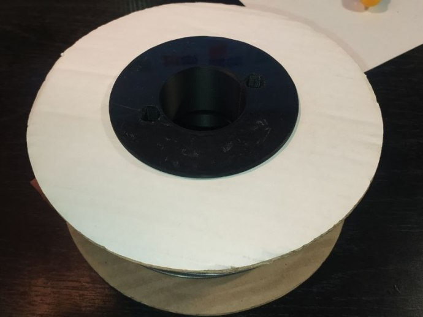

# Втулка картонной катушки HTP

Для тех, кому надоели разваливающиеся картонные катушки от HTP.

Диаметр отверстия под держатель 45 мм, посадочный диаметр под катушку 80.

Садится плотно и можно обойтись без винтов.

<picture><source media="(prefers-color-scheme: dark)" srcset="https://cdn.simpleicons.org/telegram/white"> <source media="(prefers-color-scheme: light)" srcset="https://cdn.simpleicons.org/telegram/black"> </picture> [Источник](https://t.me/Picaso3dUnofficial/244468)