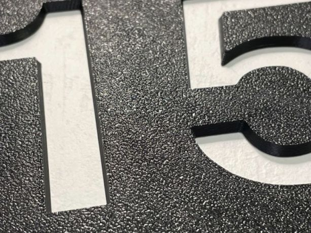

# Листы PEI для принтеров Picaso

Магнитная подложка для листа PEI клеится на стекло.

Лист PEI можно отпилить болгаркой, если не получится заказать нужный размер. Также можно спросить у продавца с Aliexpress - возможно, по заказу получится изготовить требуемый размер.

Ссылки для покупки:

1. https://sl.aliexpress.ru/p?key=HfHnxVD

1. https://a.aliexpress.com/_99EtPr

1. Лист PEI 377x370 мм: https://item.taobao.com/item.htm?spm=a1z0d.6639537/tb.1997196601.14.4ecc7484fJOoKn&id=652817769134

1. https://aliexpress.ru/item/1005004136943802.html

  
  

  
  
  

