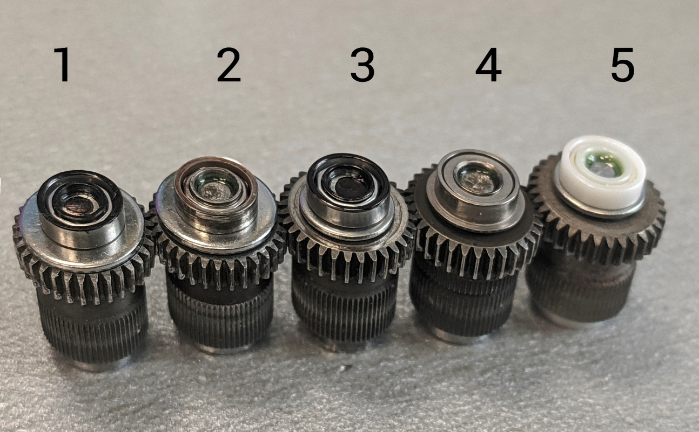
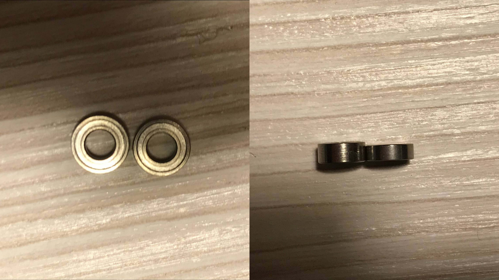
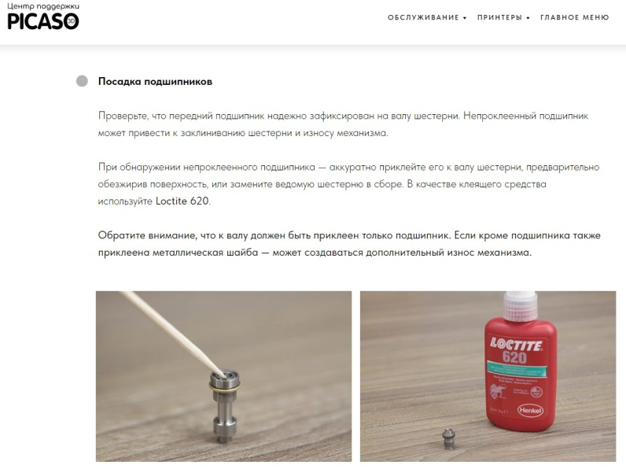

# Подшипники для принтеров X, XPRO, XL, XLPRO серии S1
---

Слева направо:

1. Китайские MR63 и широкая шайба (толщина 0,8 мм, самая широкая, что получилось найти). Данный вариант был установлен в качестве эксперимента. Итог эксперимента отрицательный. Шайба слишком широкая, упиралась в пластину и клинила;

2. Итальянские MR63 (куплены у Picaso3D) и широкая шайба. Также неудачный вариант из-за широкой шайбы. В итоге широкая шайба была заменена на обычную;

3. Китайские MR63 и обычная шайба (М3, толщина 0,5 мм), как эталонный образец;

MR63: https://aliexpress.ru/item/4000891710951.html

4. Фланцевый подшипник MF63ZZ, без шайбы;

В данном случае на ведомой оси используется комбинация из открытого MR63 и закрытого фланцевого MF63ZZ подшипников (при этом шайба не используется): есть отзывы из эксплуатации, что закрытые подшипники реже клинят. Закрытый фланцевый подшипник ставят на ведомую ось спереди (без шайбы), а сзади — открытый. Два закрытых фланцевых одновременно установить невозможно, так как толщина MR63 — 2 мм, MR63ZZ — 2,5 мм, в итоге два закрытых фланцевых подшипника просто не умещаются (вернее умещаются, но не тогда не нужно до конца закручивать винты крепления). Фланцевый подшипник возможно установить без приклеивания его на вал, так как он плотно зажимается и без клея. 

Также вместо фланцевого закрытого возможно установить просто закрытый подшипник MR63ZZ, без шайбы, он также имеет толщину 2,5 мм, по опыту участников чата его не приклеивают, устанавливается он на ведомую ось спереди и с вала не соскакивает. На момент октября 2022 года MR63ZZ ставится производителем на XL и XLPRO и не приклеиваются на вал.

MF63ZZ: https://aliexpress.ru/item/32880777629.html

MF63ZZ: https://aliexpress.ru/item/32859031010.html

MR63ZZ: https://aliexpress.ru/item/32834097040.html

5. Керамика MR63 с обычной шайбой (М3, толщина 0,5 мм).

Керамика MR63: https://aliexpress.ru/item/4000960298577.html

Вариант (1) сразу оказался неработоспособным из-за толщины шайбы. В итоге в эксперименте участвовали варианты (2), (3), (4), (5). Итальянские с широкой шайбой, которая в итоге была заменена на обычную (2), китайские с обычной шайбой (3), фланцевый подшипник (4) ходят примерно одинаковое количество часов (600-1000 часов в среднем, иногда время работы доходит до 3500-5000 часов). Керамический с обычной шайбой на момент эксперимента оказался самым надёжным, но на момент ноября 2022 года нет статистики использования керамических подшипников и информации каким образом они выходят из строя (возможно, лопается). Чаще всего в качестве кастомного варианта применяют закрытые или фланцевые подшипники.

6. Подшипники MR63ZZ толщиной 2мм, закрытые.

https://sl.aliexpress.ru/p?key=5mCDtyv

Техподдержка Picaso3D рекомендует приклеивать передний подшипник (в случае использования открытого толщиной 2 мм) к валу с ведущей шестернëй, чтобы он не слетел с вала и шестерня не начала цепляться за радиатор, вырабатывая его:

По опыту участников чата приклеивать подшипник можно на цианакрилатный клей, желательно перед этим обезжирить поверхность. Будьте аккуратны, в случае использования цианакрилатного клея подшипник может очень быстро приклеиться к валу, и не удастся его правильно расположить.

Также некоторые участники рекомендуют смазывать подшипники перед установкой в принтер для увеличения их срока службы. После набивки подшипников смазкой важно убрать её излишки.

Снять приклеенный подшипник возможно либо механически расколов его, либо путём нагрева паяльным феном с температурой около 500°С и постепенно просовывая в зазор между подшипником и шестернёй лезвие.

Теоретически возможно использовать подшипники MR63 2RS, но на момент ноября 2022 года такой эксперимент в сообществе никто не проводил.

Используемая маркировка подшипников:

+ MR — открытый подшипник (миниатюрный метрический шариковый подшипник);

+ MF — фланцевый (миниатюрный метрический шариковый подшипник с фланцем);

+ RS — один резиновый пыльник (контактное уплотнение из каучука, прорезиненное уплотнение);

+ 2RS — два резиновых пыльника;

+ Z — защитная металлическая шайба с одной стороны;

+ ZZ — защитная металлическая шайба с двух сторон ("закрытый" подшипник).

[Источник_телеграм](https://t.me/Picaso3dUnofficial/244110)
