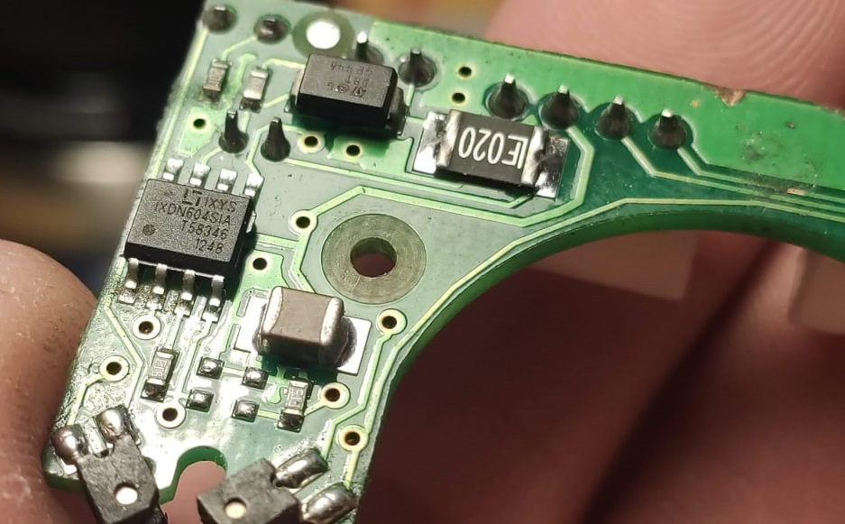
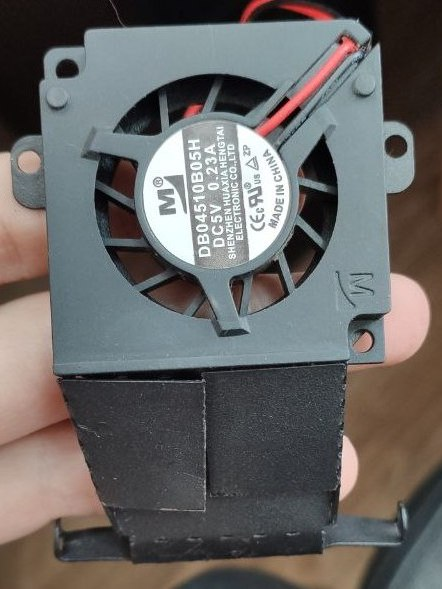

# Покупные радиоэлементы для ремонта принтеров Picaso
---

1. IWISS IWS-3220 460PCS Crimping Pliers Mini Crimper Tool for JST DuPont Terminal Narrow-pitch Connector Pins 0.08-0.5mm²AWG 32-20

https://sl.aliexpress.ru/p?key=gGwexSX

2. Разъём PHD2.0 https://sl.aliexpress.ru/p?key=Jjtexmu

3. https://sl.aliexpress.ru/p?key=3zthxQy
Я первые поставил, натянув на них термоусадку, что бы не поцарапать стол снизу. После перехода на PEI стекло ни разу не снимал

4. Драйвер IXDN604SI https://aliexpress.ru/item/1005002628524804.html

5.  Loctite 601 620 648 680 https://sl.aliexpress.ru/p?key=s5b0Zo

6. Тефлоновая трубка 1 метр

+ https://a.aliexpress.com/_A3iYtX
+ https://aliexpress.ru/item/1005001661430005.html

7. Муфты:

+ https://aliexpress.ru/item/32903954998.html
 
+ https://a.aliexpress.com/_A3zzf6

+ https://aliexpress.ru/item/32888955522.html

+ https://aliexpress.ru/item/32915024956.html

PRO250_Драйвер_IXDN604SIA

XPRO_Мотор_охлаждения_детали.jpg

XPRO_Транзистор_нагрева_сопла

