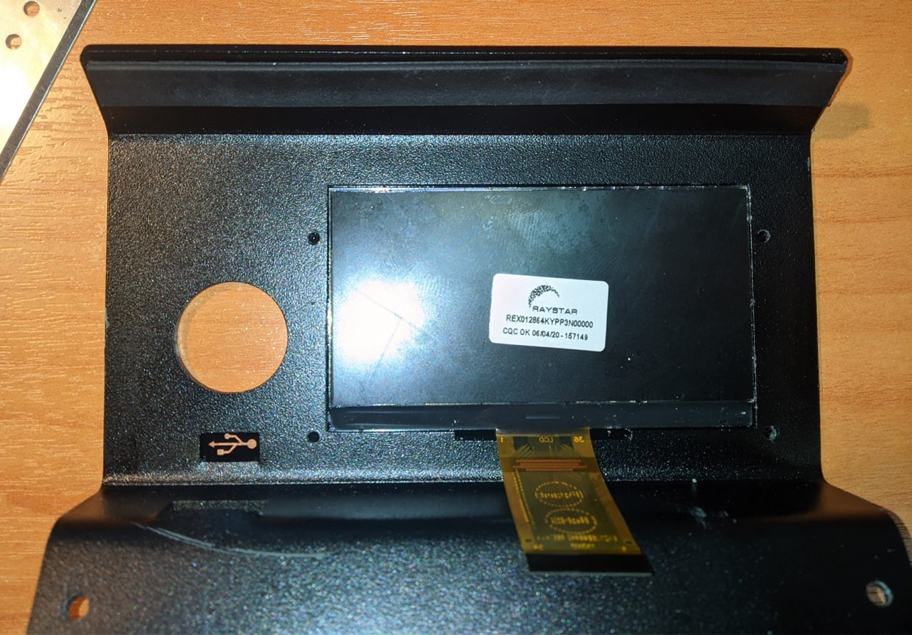
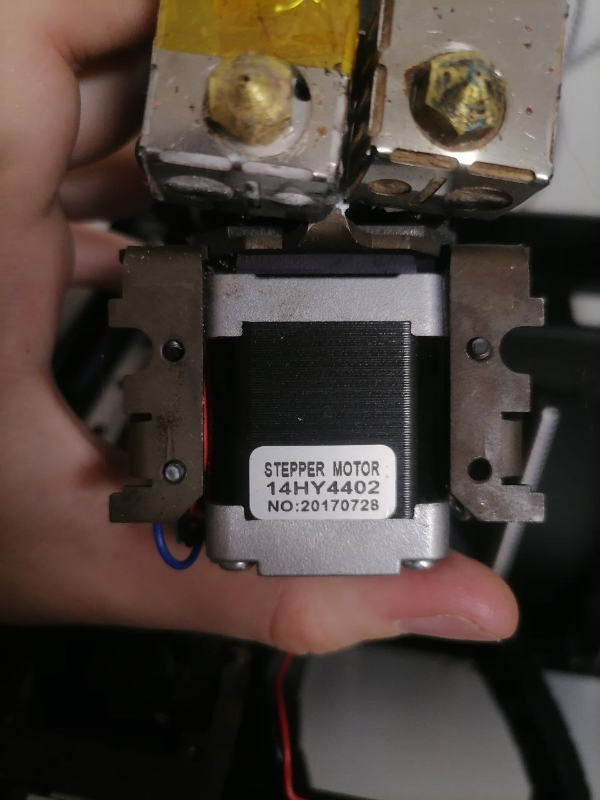

# Покупные радиоэлементы для ремонта принтеров Picaso
---

1. PRO250_Драйвер_IXDN604SIA

2. XPRO_S1_Вентилятор_охлаждения_детали

3. XPRO_Транзистор_нагрева_сопла

4. XPRO_Мотор_XY

5. XPRO_Мотор_Z

6. Дисплей_DesignerX_S1: REX012864KYPP3N00000. Возможно заменить на дисплей другого цвета, например REX012864KOPP3N00000 (отличается цветом подсветки, оранжевый вместо желтого, и немного темнее). Оригинальный дисплей вклеен в панельку — клей хорошо растворяется изопропилом.

7. XPRO_шаговый_мотор_экструдера.jpg

