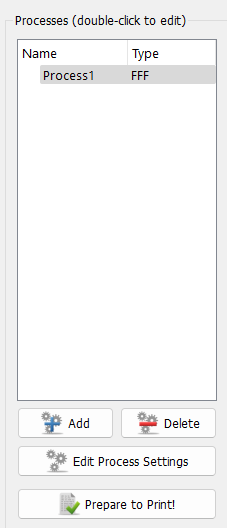
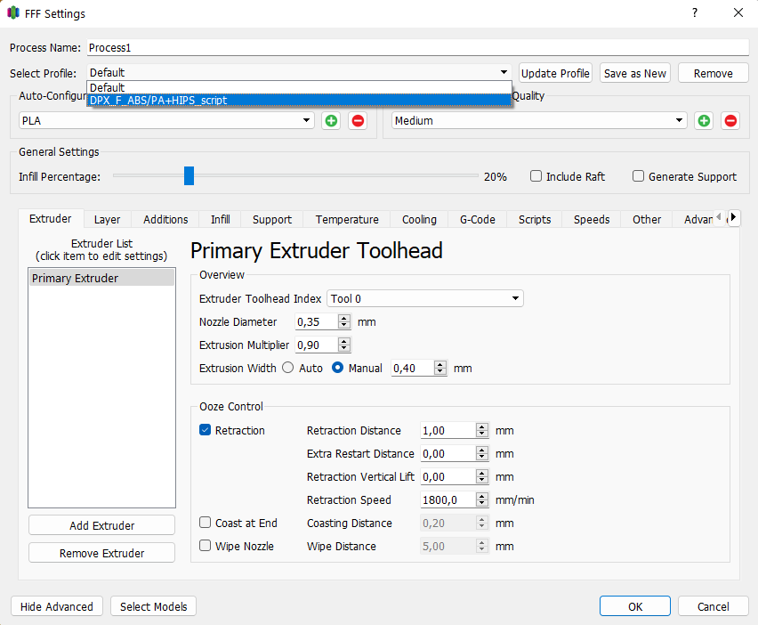

# Добавление профиля в Simplify3D
---

Для импортирования нового профиля в Simplify3D:
1. Запустить Simlify3D 
2. В меню *File* нажать *Import FFF profile*

3. В списке процессов выбрать соответствующий процесс и открыть его двойным кликом либо кнопкой *Edit process settings*

4. В списке *Profiles* выбрать добавленный профиль

Статья о настройке слайсера Simplify3D под 3D принтеры Picaso (PRO250, Designer, Classic, X, Xpro, XL, XLPro): https://picaso3d-club.ru/forum/forum44/116-kak-nastroit-slayser-simplify3d-pod-3d-printery-picaso-3d-designer.-statya-dlya-tekh_-kto-khochet-ikh-podruzhit.422
