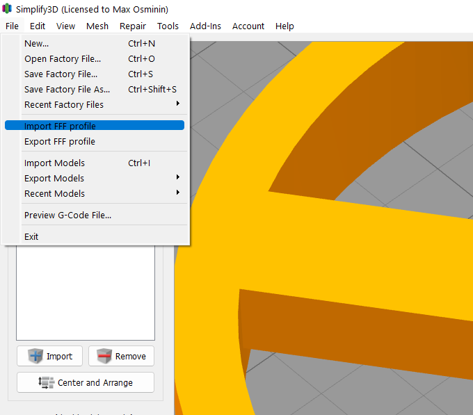

# Добавление профиля в Simplify3D

Профили для принетеров Picaso серии X S1.

Для импортирования нового профиля в Simplify3D:
1. Запустить Simlify3D 
2. В меню *File* нажать *Import FFF profile*

3. В списке процессов выбрать соответствующий процесс и открыть его двойным кликом либо кнопкой *Edit process settings*

4. В списке *Profiles* выбрать добавленный профиль

<picture><source media="(prefers-color-scheme: dark)" srcset="https://cdn.simpleicons.org/telegram/white"> <source media="(prefers-color-scheme: light)" srcset="https://cdn.simpleicons.org/telegram/black"> </picture> [Источник](https://t.me/Picaso3dUnofficial/239962)

> [Статья](https://picaso3d-club.ru/forum/forum44/116-kak-nastroit-slayser-simplify3d-pod-3d-printery-picaso-3d-designer.-statya-dlya-tekh_-kto-khochet-ikh-podruzhit.422) о настройке слайсера Simplify3D под 3D принтеры Picaso (PRO250, Designer, Classic, X, Xpro, XL, XLPro).
