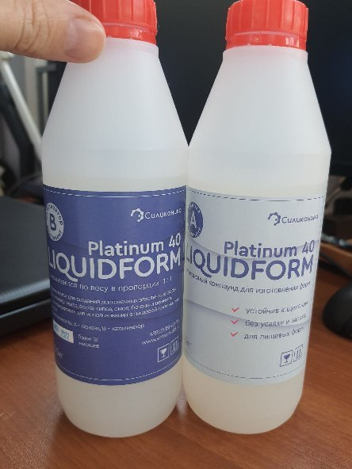
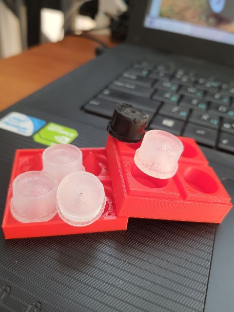

# Чистики для принтеров Picaso

По ТТХ прям один в один, та же жесткость, геометрия и температуростойкость. 
Силикон без коллера, поэтому чистики прозрачные.

В файлах есть модель самого чистика, её можно модернизировать при желении.
Два .stl файла с уже заложенным допуском специально для печати, чтобы ответная часть закрывалась.

Силикон на основе платины твердостью 20 по Шору оказался сильно мягким и чистики не выполняли свою функцию.
Для литья лучше использовать силикон на платине с твердостью 40 по Шору.
Формы из PLA.

Силикон можно купить на Ozon'е или, например, по ссылке: https://sintez-mold.ru/product/silikon-dlya-pishhevyh-form-liquidform-platinum-40-1kg/

  
   
  

<picture><source media="(prefers-color-scheme: dark)" srcset="https://cdn.simpleicons.org/telegram/white"> <source media="(prefers-color-scheme: light)" srcset="https://cdn.simpleicons.org/telegram/black"> </picture> [Источник](https://t.me/Picaso3dUnofficial/239314)
