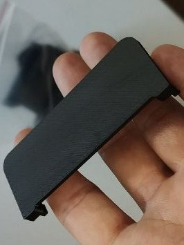
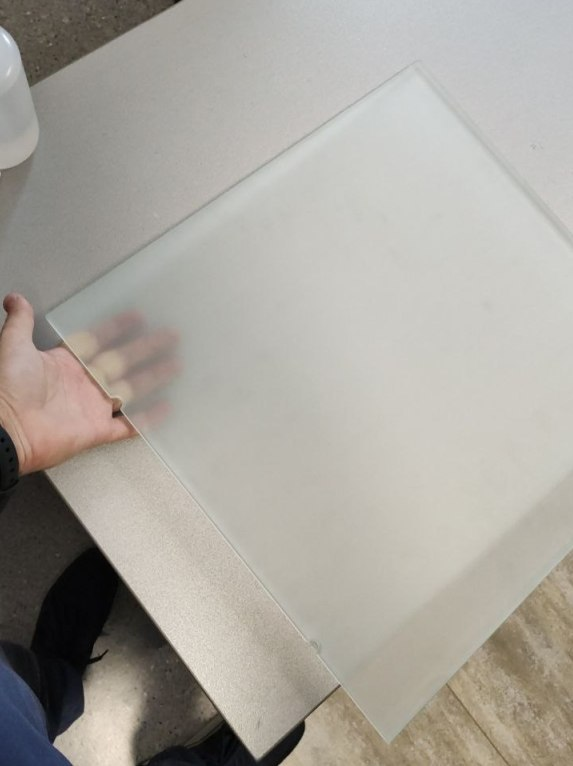
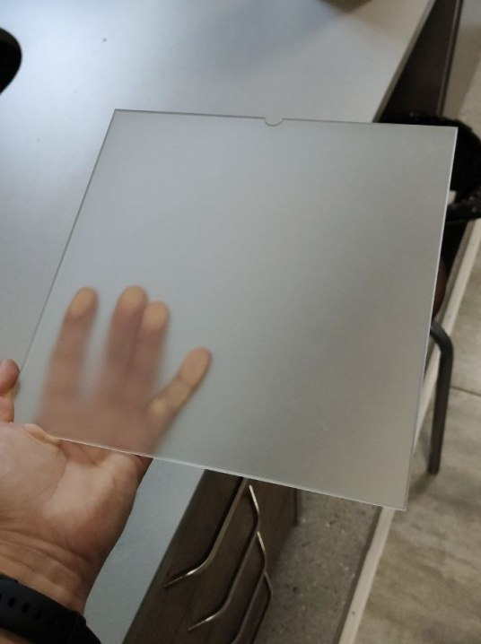
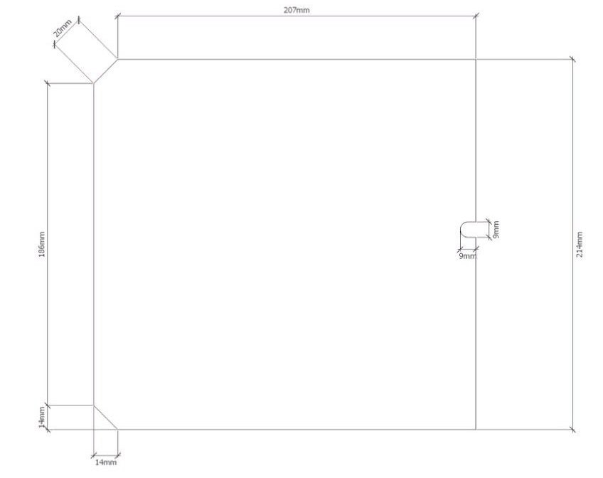

# Стёкла Designer XPRO, X, XL, XLPRO
---

Стёкла (цветное, матовое, зеркало — какое больше нравится) возможно нарезать на стеколке по чертежу. Не закалённое стекло. Стекло после закалки не режут. Фаска по желанию, можно просто обработать кромку.

Толщина стекла Designer X, XPRO — 4 мм, Designer XL,XLPRO — 8 мм.

Первое время Picaso поставляли стёкла для XPRO с выемкой 12 мм, затем стали поставлять с выемкой 10 мм. 10 мм в скобу влезает, но с усилием.

Углубления под магниты обычно на стеколке никто не хочет делать. Как вариант, можно купить тонкие магниты (0,5мм) и наклеить без углублений — отметить маркером точки и по ним наклеить.

Стекло без магнитов крепится канцелярскими прищепками или кастомными зажимами.

Возможные варианты клея для магнитов: УФ, поксипол, эпокси-металл. Picaso клеят магниты на Loctite EA 9514.

Возможно заказать матовые стёкла (пескоструй или химия) для получения первого слоя с матовой фактурой.

> Чертëж стекла для XL, XLPRO — .pdf в файлах.

> PicasoXL_glass_template_v8.stl — шаблон для приклейки магнитов на стекло для XL [^1].

XPRO_Стекло_var.0

XPRO_Стекло_var.1

Матовое стекло (химия) 

250PRO_стекло_var.0

250PRO_стекло_var.1

---

[^1]: https://t.me/Picaso3dUnofficial/268936
