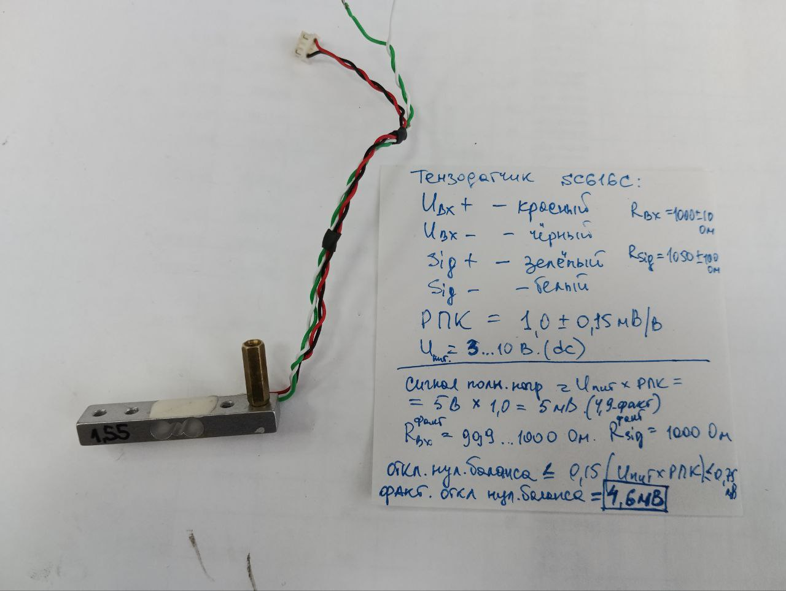

# Тензодатчик для Picaso XL и XL PRO

1. Чтобы диагностировать работоспособность тензодатчика нужно проверить напряжение смещения, оно должно быть около 0 мВ, а если измеренное значение больше 0,75 мВ - то значит тензодатчик неисправен. Чтобы измерить это напряжение необходимо:

* выключить принтер,
* снять полностью тензодатчик,
* из разъема от тензодатчика вынуть зеленый и белый провода,
* разъем с подключенными красным и черным проводом подключить обратно к плате принтера,
* включить принтер,
* мультиметром в режиме измерения постоянного напряжения проконтролировать напряжение между белым и зеленым проводами. Оно должно быть близким к 0 мВ (не более 0,75 мВ).

> Возможно обойтись без принтера, подав 5 В с помощью внешнего источника питания.

2. Если датчик раюотоспособен, то установить его согласно инструкции. Пластина должна стоять со стороны 2-х винтов. 

> Совет: есть ключевой нюанс в установке, при котором тензодатчик будет выдавать неверные значения: после того как закрутили все винты и пока не схватился фиксатор, нужно тот винт, который ставится на фиксатор резьбы, выкрутить ровно на один оборот,. Только при такой установке можно поймать регулировочным винтом (который на стойке с пружиной) нужные значение напряжения тензодатчика в свободном положении от 1 до 2 В. У меня обычно около 1,6-1,7 В. Это напряжение нужно подкручивать до такого значения, чтобы при любом нажатии в нагревательный блок снизу напряжение становилось 3,27 В, а при нажатии на каретку от себя – где-то 0,128 В. При таком раскладе все будет работать корректно.

  

<picture><source media="(prefers-color-scheme: dark)" srcset="https://cdn.simpleicons.org/telegram/white"> <source media="(prefers-color-scheme: light)" srcset="https://cdn.simpleicons.org/telegram/black"> </picture> [Источник](https://t.me/Picaso3dUnofficial/321823)
